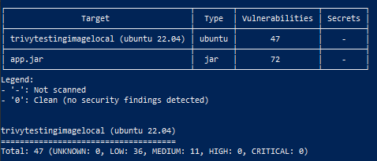
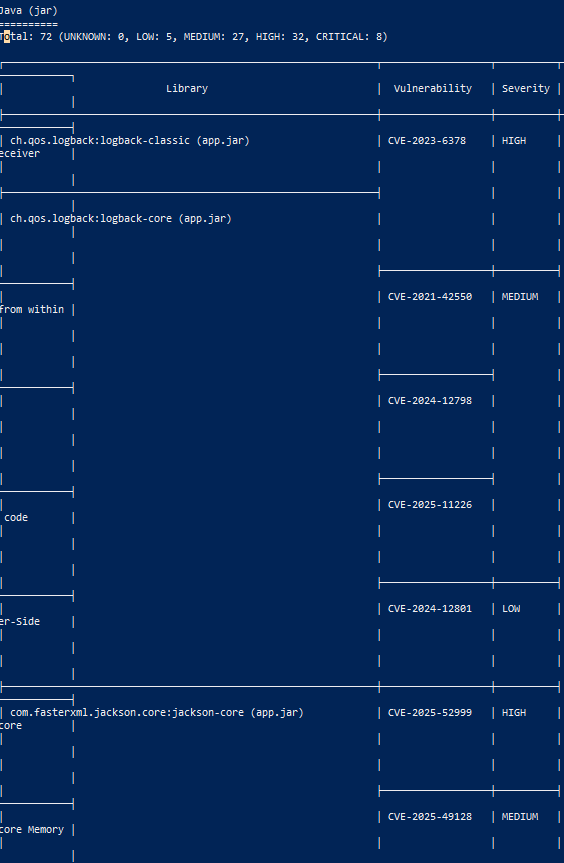
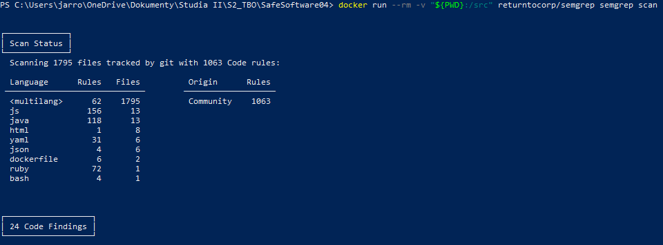
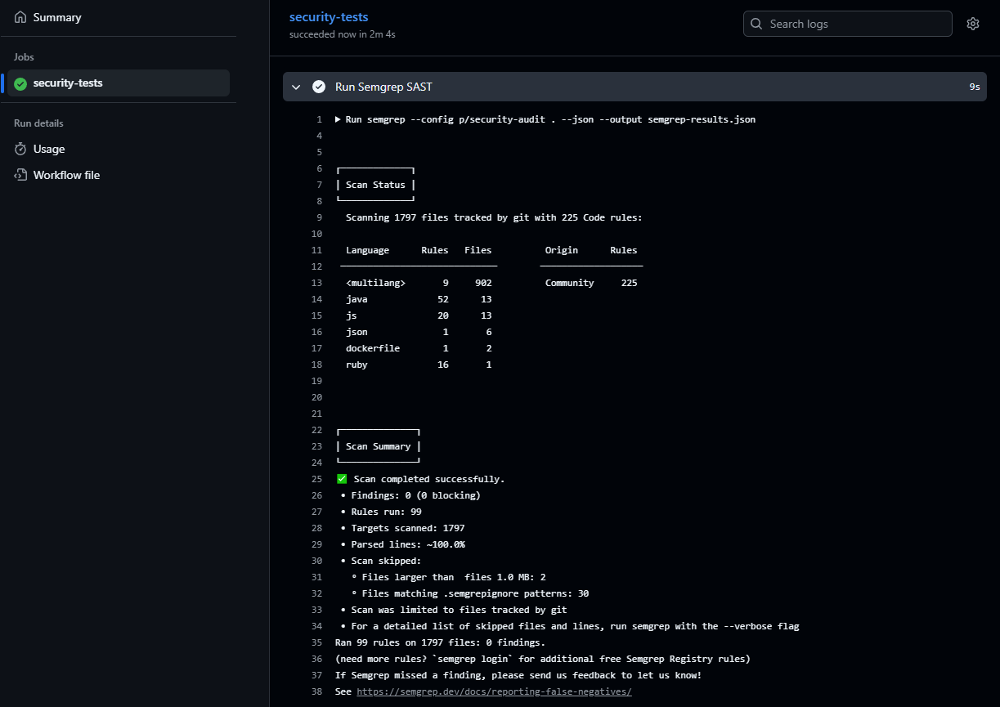
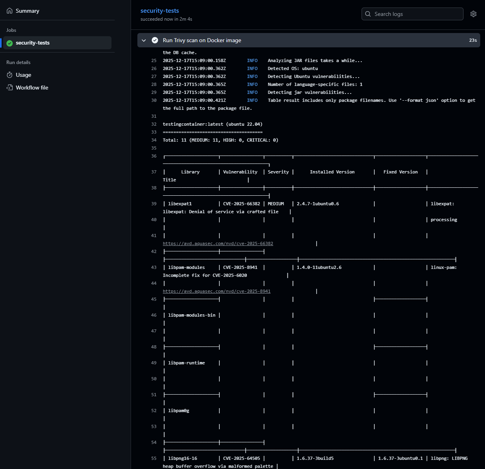
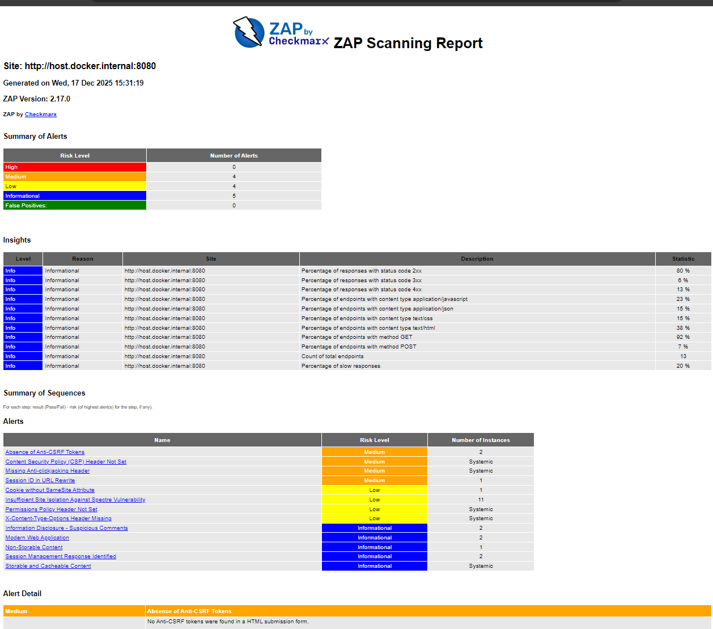

## Zadanie 1. SCA z Trivy
W celu zbudowania obrazu należało wprowadzić zmianę w Dockerfile aby wskazywał na odpowiedni tag. openjdk:11-jdk-slim nie odpowiadał zgodnie z poniższym wynikiem akcji w Wycinku kodu 1.

```
(terminal)> docker pull openjdk:11-jdk-slim
Odpowiedź: Error response from daemon: failed to resolve reference "docker.io/library/openjdk:11-jdk-slim": docker.io/library/openjdk:11-jdk-slim: not found 
```
Wycinek kodu 1. Problem z openjdk:11-jdk-slim - przestarzałe budowanie obrazów

Wprowadzono zmianę aby obraz był budowany przez aktualny eclipse temurin zgodnie z Wycinkiem kodu 2.

```
-FROM openjdk:11-jdk-slim

+FROM eclipse-temurin:11-jdk-jammy
```
Wycinek kodu 2. Wprowadzone zmiany w Dockerfile

Po ustaleniu odpowiedniej dystrybucji w Dockerfile utworzono obraz aplikacji a następnie wykorzystano trivy w celu przeprowadzenia testów aplikacji. Wyniki przeprowadzonych testów zaprezentwowano na Zdj. 1-2. Informacje o "problemach" w samym obrazie (de facto bibliotekach systemowych Ubuntu) można zignorować. Natomiast, informacje o samej aplikacji i jej podatnościach są kluczowe. W tym wypadku zidentyfikowano aż 8 podatności krytycznych. Wystąpiły one w bibliotekach H2, Tomcat oraz Spring. Pośród podatności zarejestrowano chociażby RCE (remote code execution). Podążając za dołączonymi do podatności linkami, na stronie https://avd.aquasec.com/ można przeczytać o potencjalnych rozwiązaniach oraz w detalach zrozumieć problemy. Trivy przeprowadza de facto SCA.


Zdj. 1. Wykryte podatności w pliku obrazu


Zdj. 2. Wykryte podatności w bibliotekach aplikacji

## Zadanie 2. SAST z Semgrep
Kolejnym oprogramowaniem do przeprowadzanie analizy statycznej kodu był Semgrep. Tym razem wykonano testy kodu źródłowego (statyczne). Wyniki przedstawiono na Zdj. 3.


Zdj. 3. Wykryte podatności w kodzie źródłowym aplikacji

Łącznie wykryto 24 podatności. Biorąc pod uwagę naturę SAST, każdą podatność należałoby zweryfikować względem "zdrowego rozsądku" przez występowanie fałszywych pozytywów. Wśród podatności wykryto XSS.


```
│ Scan Summary │                                                                                                                                                                    └──────────────┘                                                                                                                                                                    ✅ Scan completed successfully.                                                                                                                                                       • Findings: 24 (24 blocking)                                                                                                                                                        • Rules run: 448                                                                                                                                                                    • Targets scanned: 1795                                                                                                                                                             • Parsed lines: ~99.9%                                                                                                                                                              • Scan skipped:                                                                                                                                                                       ◦ Files larger than  files 1.0 MB: 2                                                                                                                                                ◦ Files matching .semgrepignore patterns: 30                                                                                                                                      • Scan was limited to files tracked by git                                                                                                                                          • For a detailed list of skipped files and lines, run semgrep with the --verbose flag                                                                                              Ran 448 rules on 1795 files: 24 findings. 
```
# Zadanie 3. CI/CD z Trivy i Semgrep
Utworzono plik security-scan.yml jako plik wykonywania "jobów" zdefiniowanych w YAML, kompatybilnym z github actions. Następnie wypchnięto zmiany do repozytorium. Pierwsza próba zakończyła się niepowodzeniem, ponieważ wykorzystano przestarzały mechanizm tworzenia artefaktów. Po zmianie ponownie wykonano akcję git push. Tym razem workflow wykonał się w zakładce actions, z wynikiem pozytywnym - przeprowadzonymi testami przez Semgrep (SAST) oraz Trivy (SCA). Zaprezentowano to na Zdj. 4-5.


Zdj. 4. Automatyczne wykonanie testów przy wypchnięciu kodu do repozytorium - Semgrep


Zdj. 5. Automatyczne wykonanie testów przy wypchnięciu kodu do repozytorium - Trivy

Artefakt z wykonanych testów semgrepu można pobrać pod linkiem: [artifact link](https://github.com/jarrok3/SafeSoftware04/actions/runs/20307416733/artifacts/4900222965) lub przez UI githuba jako dołączony artefakt na dole info-view runa.

## Zadanie 4. Testy dynamiczne z OWASP ZAP
Wykonano testy dynamiczne aplikacji. Zgodnie z oczekiwaniami wyniki analizy były znacznie dokładniejsze niż w wypadku zwykłego SAST. Jest to powiązane z metodyką wykonywania testów dynamicznych. Symulują one setki lub tysiące ataków SQL, XSS i innych na aplikacji. W efekcie mimo intruzywności i solidnego obciążania serwera stanowią one najdokładniejszą formę do testowania aplikacji webowych. Niestety są długie a ich konfiguracja znacznie trudniejsza niż SAST lub SCA, stąd z punktu widzenia praktycznego potrzebne są programy jak OWASP ZAP automatyzujące proces. Wynik analizy zap przedstawiono na Zdj. 6.


Zdj. 6. Testy dynamiczne - zap owasp (wynik)

W przeciwieństwie do SAST, testy dynamiczne wykryły podatności w nagłówkach z dokładną deskrypcją sposobu ataku. Z punktu widzenia programisty stanowi to bezpośredią informację gdzie wprowadzić poprawki. Testy dynamiczne wykazały się równiez mniejszą ilością wykrytych podatności względem SAST, co jest powiązane z FP (false positives) jakie tworzą się w SAST. Deskryptory są dokładniejsze, wsparcie wyraźniej wskazane przez podanie linków, natomiast liczba podawancych "błędów" aplikacji mniejsza.

W połączeniu z SCA testy dynamiczne stanowią silne zabezpieczenie przed błędami w aplikacjach. Mimo to, częste wykonywanie testów dynamicznych jest zazwyczaj niemożliwe, przez ograniczenia serwera lub z innych powodów. W efekcie warto zawsze zabezpieczyć swoje projekty (repozytoria) w automatyczne testy SCA oraz SAST, aby mieć zapewnioną pewną siatkę bezpieczeństwa. Okazjonalnie warto również wykonać bezpośrednie testy dynamiczne np. w okresach niższego ruchu na stronie. 